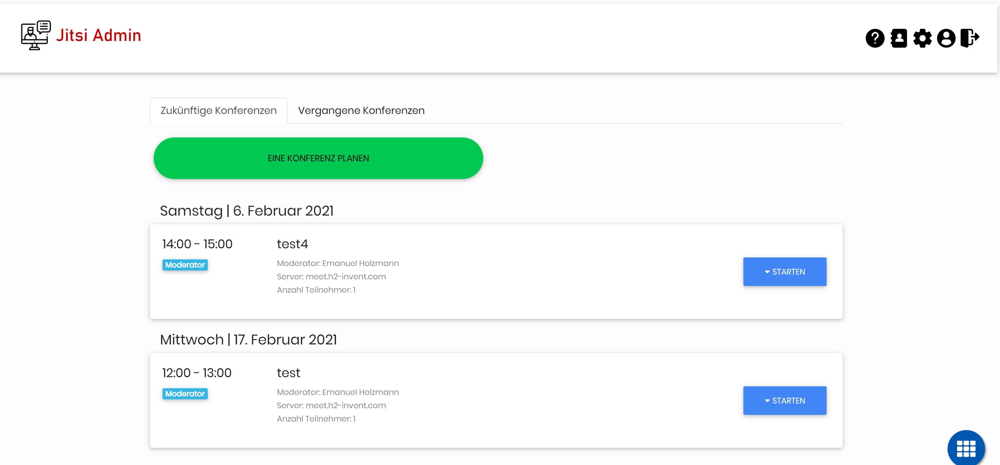
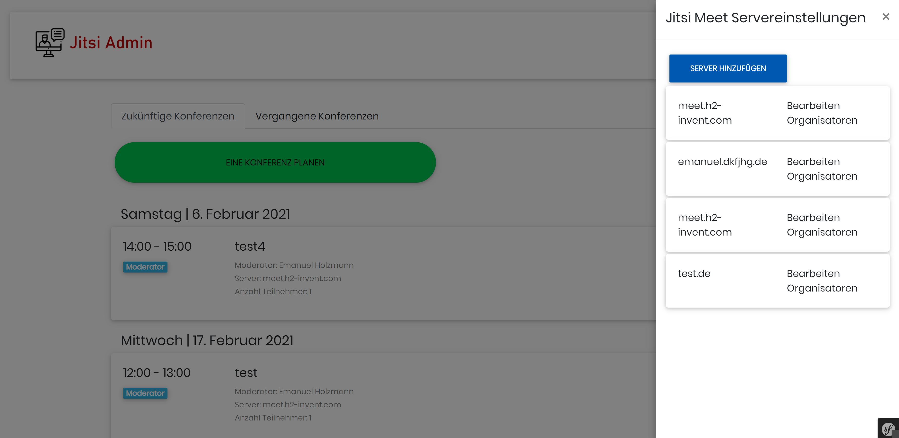
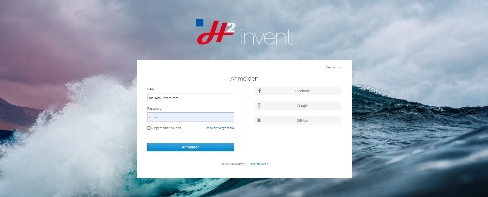
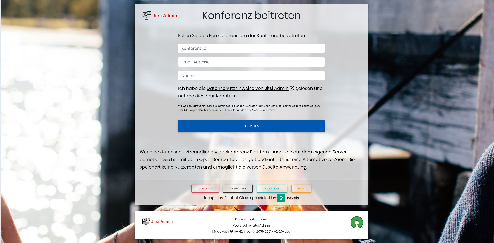

# Jitsi Manager

Jitsi Manager oder Jitsi Admin zum Verwalten von Jitsi Konferenzen und Server mit JWT

# Funktionen
Folgende Funktionen sind bereits im Jitsi Administrator integriert:
* Verwalten von Konferenzen
* Verwalten von Jitsi Servern mit JWT Funktion
* Hinzufügen von Teilnehmern zu einer Konferenz
* Verschicken von Emails an die Teilnehmer
* Verschicken von Emails vor der Konferenz über einen CronJob

### Das Dashboard
Alle Informationen zu den Konferenzen stehen auf dem zentralen Dashboard

### Die Server
Alle Server können zentral verwaltet werden und unterschiedliche Berechtigungen verteilt werden.
Es können mehre Jitsi Server in einer Installation verwaltet werden.

### Login
Der Login erfolgt über einen SSO Server, z.B. Keycloak oder weitere Identidy Provider

### Join der Konferenz
Gäste können über einen Link in der Email der Konferenz beitreten __ohne__ einen Benutzer im Jitsi Manager zu haben.
Den Gästen steht eine Seite zum Beitreten bereit. Es wird nach der Konferenz ID, der Email Adresse und dem Namen gefragt.
Danach wird ein JWT erstellt mit dem der Gast der Konferenz beitreten kann.

Benutzer können direkt aus dem Jitsi Manager heraus der Konferenz beitreten, entweder über den Browser oder über die Jitsi Electron Desktop App auf dem PC.

Mehr Informationen auf https://jitsi-admin.de
# Get Started
Auf Grund der Composer Abhängigkeiten wird ein Webspace für den Betrieb der Webanwendung nicht empfohlen. Enterprise bedeutet, dass der Jitsi Admin als Manadatenlösung und interne Webanwendung betrieben werden kann. Die Verwaltung, Updates und Wartung muss durch die Zuständige und Verantwortliche Person durchgeführt werden.

* [Anleitung im Wiki](https://github.com/H2-invent/jitsi-admin/wiki/Get-Started)
* [Mindestanforderungen](https://github.com/H2-invent/jitsi-admin/wiki/Mindestanforderungen-an-den-Server)

# API
Mit der API ist es möglich Konferenzen durch eine andere Anwendung erzeugen zu lassen.

Es muss in die Datenbank ap_key manuel eine client_iD und ein ´´client_secret´´ eingeben werden.
Bei jedem request an die API muss der der API Secret über den parameter clientSecret mitgegeben werden.
Es sollten nur Zugriffe von einem Backend-Server auf den Jitsi-Admin durchgeführt werden.

* Infos zu einer Konferenz (GET /api/v1/{uidReal})
* Eine Konferenz erstellen (POST /api/v1/room)
* Eine Konferenz bearbeiten (PUT /api/v1/room)
* Eine Konferenz Löschen (DELETE /api/v1/room)
* Einen Teilnehmen zu einer Konferenz hinzufügen (POST /api/v1/user)
* Einen Teilnahmen von einer Konferenz löschen (DELETE / api/v1/user)
* Infos zu einem User (GET /api/v1/serverInfo)

# Lizenz
Die aktuelle Version von Jitsi Admin wird unter der AGPL-3.0 License bereitgestellt. Weitere Informationen finden Sie in der LICENSE Datei in diesem Repo.

